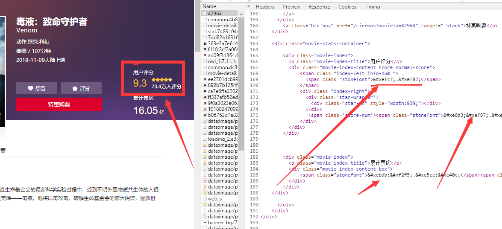
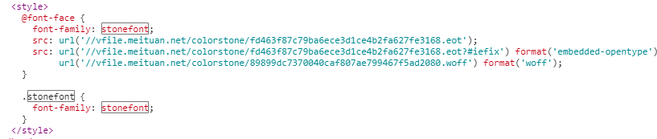
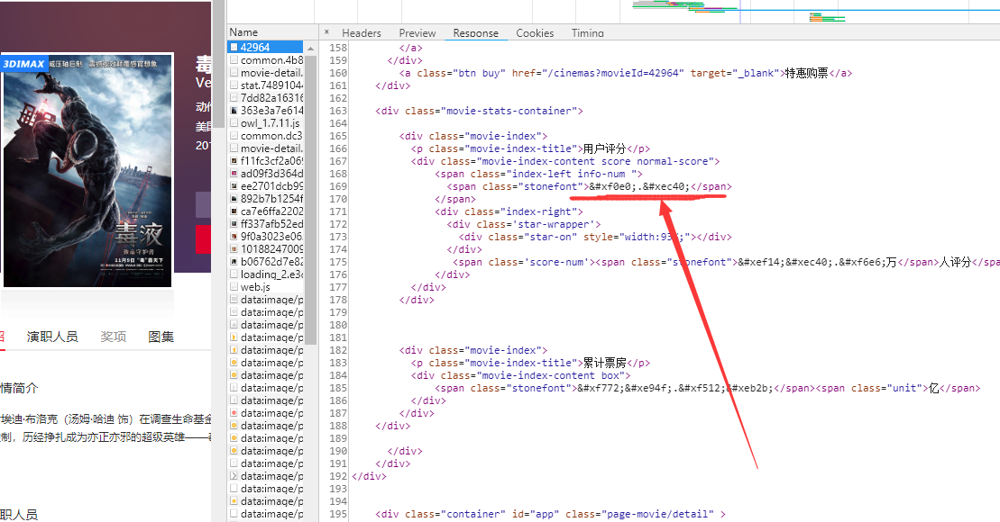
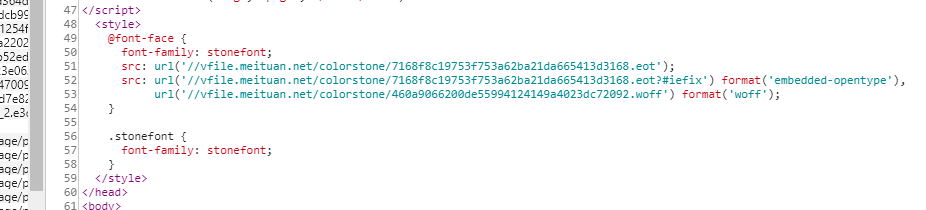
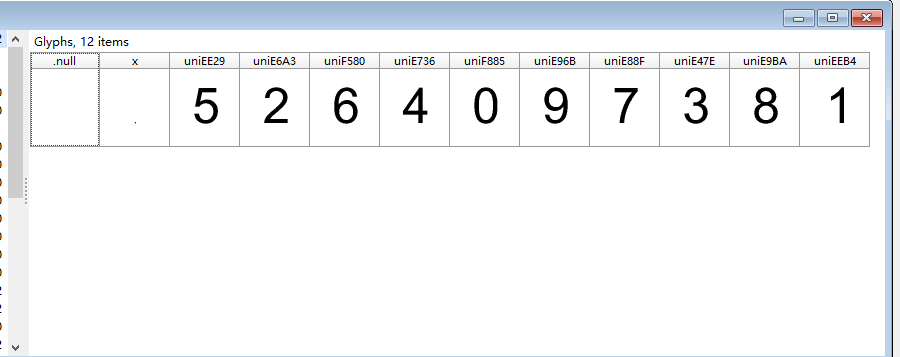
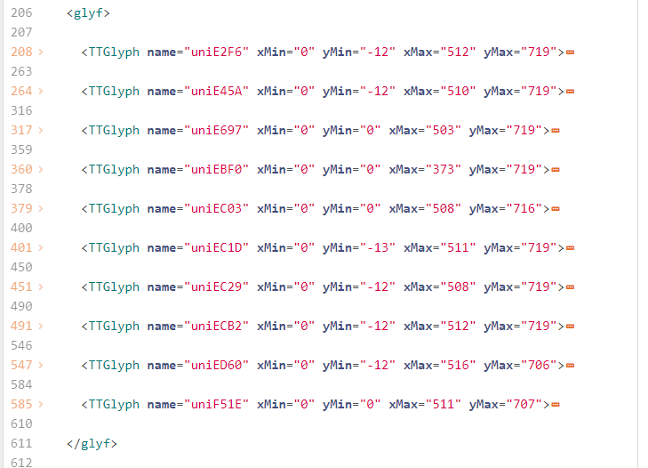
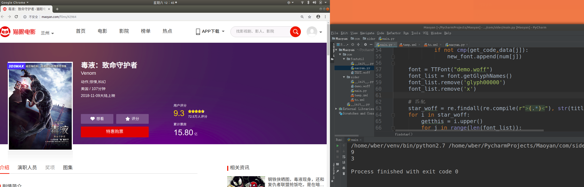

# 猫眼网反爬虫策略的处理

# 2018/12/7测试有效

# 注意:爬取频繁之后，会根据mac与ip地址封禁，修改为局域网其他ip后，大概5-6次修改，就会封网关

### [目录]
* [一.引入问题](#一.引入问题)
* [二.分步实现](#二.分步实现)
  - [页面爬取](#页面爬取)
  - [woff下载](#woff下载)
  - [字体解析规则](#字体解析规则)

-------
## 一.引入问题


可以看到,猫眼网电影评分,票房等的数据在响应的html中并不是直接提供给你的。这里的xefcf,xef87等数据,是以‘特殊符号’的形式显示出来的。



可以发现这里请求了一个woff字体文件,而xefcf,xef87等数据的规则就是在这其中的。所以我们只需要在请求这个网页的同时,截去这部分style,然后获得woff地址,将它下载到本地,进行解析,就可以实现对评分的解密了。

但是再来看下面,当同一部电影的页面刷新时。




这里的评分编码改变了,下面请求的woff的url也改变了。所以每次请求电影页面使用的woff都不是同一个。

在这种情况下,如何才可以实现评分的爬取呢？


### 二.分步实现

#### 1.页面爬取

第一步我们需要先将整个html页面获取,其中重要的数据就是评分所在的那个span,还有woff的url所在的那个style.

这里使用requests获取网页内容,用BeautifulSoup进行关键内容解析.

```python
# 请求头设置
header = {
    'Accept': '*/*;',
    'Connection': 'keep-alive',
    'Accept-Language': 'zh-CN,zh;q=0.9',
    'Accept-Encoding': 'gzip, deflate, br',
    'Host': 'maoyan.com',
    'Referer': 'http://maoyan.com/',
    'User-Agent': 'Mozilla/5.0 (X11; Linux x86_64) AppleWebKit/537.36 (KHTML, like Gecko) Chrome/67.0.3396.87 Safari/537.36'
}
def web(url):
    db_data = requests.get(url, headers=header)
    # 这里直接将其编码之前部分替换掉，防止之后使用转义
    soup = BeautifulSoup(db_data.text.replace("&#x",""), 'lxml')
    titles = soup.select(
        'body > div.banner > div > div.celeInfo-right.clearfix > div.movie-stats-container > div > div > span > span')
    wotfs = soup.select('head > style')

    wotflist = str(wotfs[0]).split('\n')
    maoyanwotf就是当前页面所使用的woff地址了。

     = wotflist[5].replace(' ','').replace('url(\'//','').replace('format(\'woff\');','').replace('\')','')
```
此时titles就是一个获取了评分span的list，当然它只有一个元素。

maoyanwotf就是当前页面所使用的woff地址了。

#### 2.woff下载

上一步我们得到了maoyanwotf，其中是当前页面所使用的woff地址,所以接下来就要对这个url进行下载,保存到本地。

```python
# 下载请求电影页面的woff字体到本地
def downfont(maoyanwotf):
    r = requests.get('http://'+maoyanwotf)
    with open("demo.woff", "wb") as code:
        code.write(r.content)
    font = TTFont("demo.woff")
    font.saveXML('to.xml')
```

这样就下载到了这次请求页面所用的woff了,保存为demo.woff。


#### 3.字体解析规则

那么这个to.xml有什么用呢？

这就是我们在每次刷新都会改变woff的情况下,实现爬取的关键所在了。

font.saveXML('to.xml')就是将TTFont打开的woff转换为xml的形式,在xml中我们可以直接找到字体的相关数据,比如一个字符的笔画信息等。

来看一个字体xml文件的重要内容。完整内容参考:[to.xml](https://blog-static.cnblogs.com/files/LexMoon/to.xml)

```xml
<!--GlyphOrder 这个标签中就是这个字体xml包含的字符种类了,glyph00000和x这两个不用考虑 -->
<GlyphOrder>
  <GlyphID id="0" name="glyph00000"/>
  <GlyphID id="1" name="x"/>
  <GlyphID id="2" name="uniEE29"/>
  <GlyphID id="3" name="uniE6A3"/>
  ....
  <GlyphID id="9" name="uniE47E"/>
  <GlyphID id="10" name="uniE9BA"/>
  <GlyphID id="11" name="uniEEB4"/>
</GlyphOrder>
<!--glyf 这个标签中是这些字体的具体坐标画法,一个TTGlyph对应一个字体,而其中contour标签的坐标数据,就是唯一确定这个字体是什么的最好的确定方法-->
<glyf>
  <TTGlyph name="glyph00000"/><!-- contains no outline data -->
  <TTGlyph name="uniE47E" xMin="0" yMin="-13" xMax="511" yMax="719">
    <contour>
      <pt x="130" y="201" on="1"/>
      ...
      <pt x="42" y="189" on="1"/>
    </contour>
    <instructions/>
  </TTGlyph>
  ...
  ...
  <TTGlyph name="uniE6A3" xMin="0" yMin="0" xMax="503" yMax="719">
    <contour>
      <pt x="503" y="84" on="1"/>
        ...
      <pt x="152" y="84" on="1"/>
    </contour>
    <instructions/>
  </TTGlyph>

</glyf>
```

##### GlyphOrder 这个标签中就是这个字体xml包含的字符种类了,glyph00000和x这两个不用考虑。
##### glyf 这个标签中是这些字体的具体坐标画法,一个TTGlyph对应一个字体,而其中contour标签的坐标数据,就是唯一确定这个字体是什么的最好的确定方法。


所以可以得出结论,不管每次请求的woff怎么变,它里面的字符的contour标签内的坐标画法是不会改变的。

既然如此,我们只需要一个模板,在这个模板中,我们先手动解码一个充当模板的woff。

如何制作这样一个模板呢？

我们先来找一个woff和woff生成的xml，woff可以用字体查看器High-Logic FontCreator打开,或者使用这个网页 http://fontstore.baidu.com/static/editor/index.html  。效果如下。



之后我们将模板xml里面的glyf中TTGlyph标签的name属性与打开的woff对应比较,得到这个数值列表(我这里woff和xml用的不是同一个，所以不要用这个比较！！！)



之后我们就可以根据glyf中TTGlyph的顺序得到解码数值的顺序,之所以要一一对应,是为了方便之后用下标索引。

```python
  num = [8,6,2,1,4,3,0,9,5,7]  #这个值是直接硬编码进去的。
  data = []
  # 此处以解析xml的方式得到这个模板xml里面contour标签的内容。
  xmlfilepath_temp = os.path.abspath("temp.xml")
  domobj_temp = xmldom.parse(xmlfilepath_temp)
  elementobj_temp = domobj_temp.documentElement
  subElementObj = elementobj_temp.getElementsByTagName("TTGlyph")
  for i in range(len(subElementObj)):
    rereobj = re.compile(r"name=\"(.*)\"")
    find_list = rereobj.findall(str(subElementObj[i].toprettyxml()))
    data.append(str(subElementObj[i].toprettyxml()).replace(find_list[0],'').replace("\n",''))

```

最后data里面是glyf中TTGlyph按顺序的内容,其中当然就是contour了,而它的下表与num中一一对应,也就是说，这时候给你一个contour的坐标内容，那就可以在data中查找它的对应下标,根据这个下标找到num中下标的元素,这个元素就是解码后的值了！！！
‘

获得了模板,我们接下来就可以将请求这次页面时获得的woff转化为xml进行对应了。

```python
font = TTFont("demo.woff")
font.saveXML('to.xml')

#本次请求下载的字体的contour
new_font = []
xmlfilepath_find = os.path.abspath("to.xml")
domobj_find = xmldom.parse(xmlfilepath_find)
elementobj_find = domobj_find.documentElement
tunicode = elementobj_find.getElementsByTagName("TTGlyph")
for i in range(len(tunicode)):
    th = tunicode[i].toprettyxml()
    report = re.compile(r"name=\"(.*)\"")
    find_this = report.findall(th)
    get_code = th.replace(find_this[0], '').replace("\n", '')
    for j in range(len(data)):
        if not cmp(get_code,data[j]):
            new_font.append(num[j])
```

其中get_code就是这次页面时获得的字体数据的list元素之一了，通过循环遍历，最终得到了一个本次xml的对应数字的list : new_font 。

接下来获得一个编码与具体数字对应的font_list

```python
    font = TTFont("demo.woff")
    font_list = font.getGlyphNames()
    font_list.remove('glyph00000')
    font_list.remove('x')
```

此时,有了new_font中的具体数字和font_list中的编码值就可以完全解码这个页面中因为woff编码反爬虫的评分了。

```
# 匹配
star_woff = re.findall(re.compile(r">(.*)<"), str(titles[0]))[0].replace(';','').split('.')  ;titles[0]是在第一步网页解析时获得的评分所在span
for i in star_woff:
    getthis = i.upper()
    for j in range(len(font_list)):
        if not cmp(getthis,font_list[j].replace("uni","")):
            print(new_font[j])
```


这样就会输出评分的整数部分和小数部分了。虽然这里只是输出了这两个数字，但是反爬虫评分,票房,人数等数据均可以使用前一步的new_font和font_list进行处理,就不再加以阐述了。


