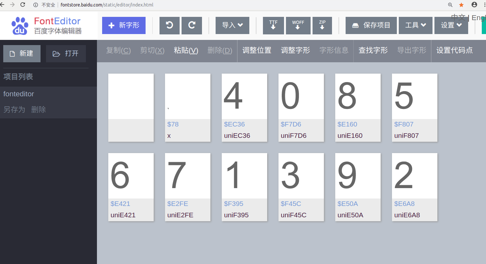
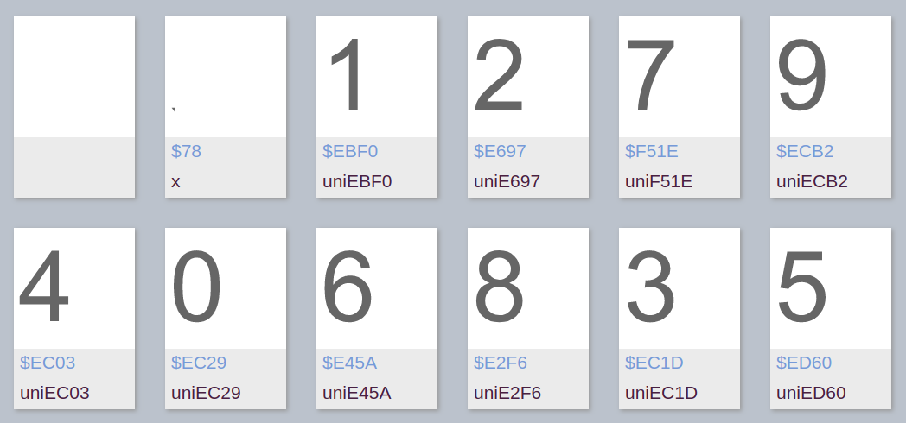
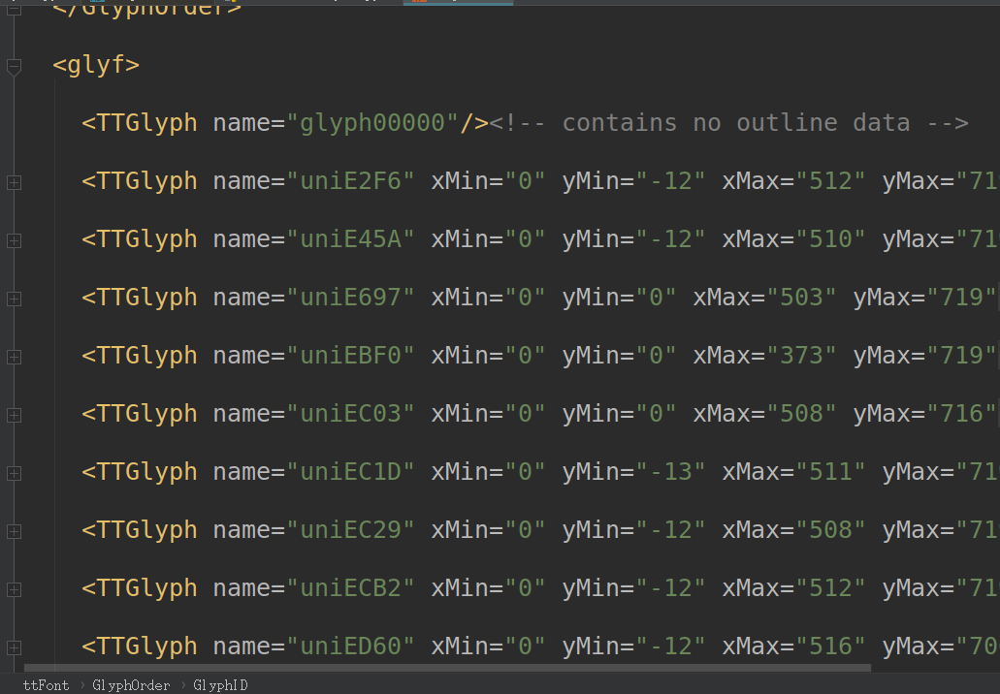
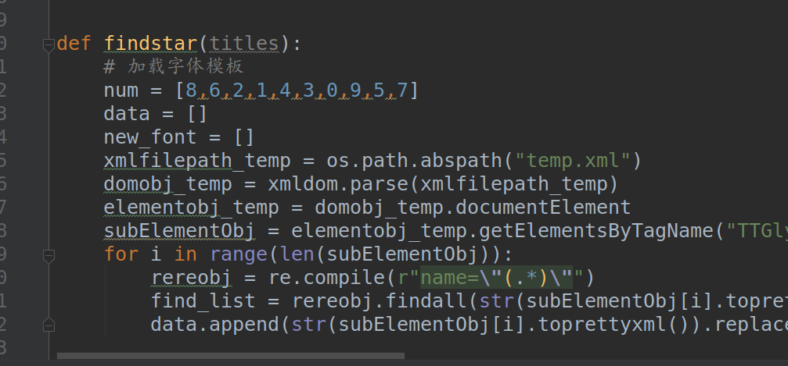

# temp.xml如何得来

一. 先从猫眼网下载一个woff


复制woff的url,从浏览器下载.


二. 使用字体解析软件打开woff,可以使用字体查看器High-Logic FontCreator打开,或者使用这个网页
http://fontstore.baidu.com/static/editor/index.html
    
效果如下:


三. woff转换为xml

将之前下载的woff重命名为temp.woff,使用下面代码转化为xml格式。

```
# -*- coding: utf-8 -*-
from fontTools.ttLib import TTFont

font = TTFont("temp.woff")
font.saveXML('temp.xml')
```

打开xml,其中关键的数据有GlyphOrder和glyf这两个标签。

将在前在网页打开的woff编码数字对应表与xml比较( name="glyph00000"和name="x"忽略)。





根据glyf中name的编码顺序与上面的对照表,就可以得到glyf的解码数据顺序,也就是在代码中num中数据的顺序。




之后我们将glyf中TTGlyph标签中字体的内容contour标签也按照顺序读入data中,就可以与num对应起来了,num中每个数字与data中字符对应,data中字符就是这个字体的画法数据,不同字符的这个data数据都是不同的.

如果要使用新temp的xml,就需要先使用
```python
font = TTFont("temp.woff")
font.saveXML('temp.xml')
```
得到一个xml,然后手动将glyf中TTGlyph对应的字符按照相应顺序写成一个num列表,用这个新的num列表替换代码中原先的num中数据.
